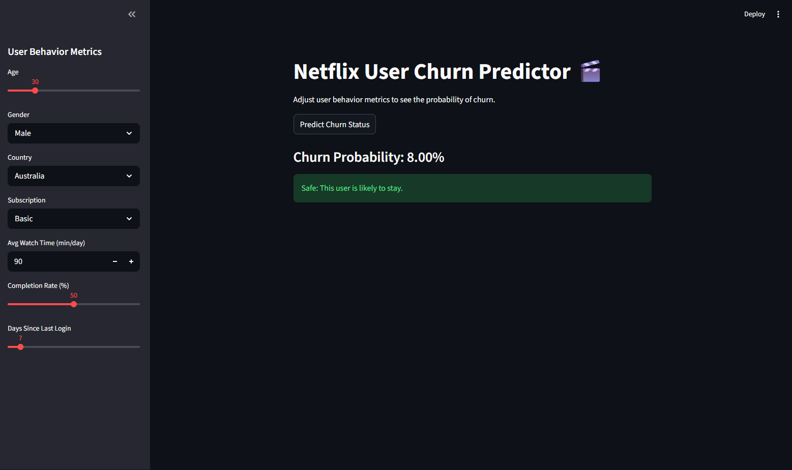

# 🎬 Netflix User Churn Prediction & MLOps Deployment

This project demonstrates an end-to-end Machine Learning pipeline—from data engineering and model training to a production-ready containerized deployment. It predicts whether a user is likely to "churn" (cancel their subscription) based on behavioral metrics like watch time, engagement, and account age.

**Career Goal Focus:** This project showcases **AI Engineering** and **MLOps** skills by moving beyond a local Jupyter Notebook into robust environment management, synthetic data handling, and Dockerized deployment.

graph TD
    subgraph 1. Data Engineering
        A[Raw Netflix Data] -->|fix_data.py| B(Inject Business Logic)
        B --> C[Balanced & Cleaned Data]
    end

    subgraph 2. Model Training
        C --> D[RandomForest Classifier]
        D -->|scikit-learn 1.8.0| E[Evaluate & Tune]
        E -->|Save Weights| F[(churn_model_balanced.pkl)]
        E -->|Save Encoders| G[(label_encoders.pkl)]
    end

    subgraph 3. Application Layer
        F --> H[Streamlit Dashboard app.py]
        G --> H
        H -->|User adjusts sliders| I{Real-Time Prediction}
    end

    subgraph 4. Containerized Deployment
        H -.->|requirements.txt| J[Docker Build]
        J -.->|python:3.11-slim| K((Running Docker Container))
        K -->|Expose Port 8501| L[End User / Recruiter]
    end

    %% Colors %%
    style A fill:#f9d0c4,stroke:#333,stroke-width:2px
    style I fill:#d4edda,stroke:#333,stroke-width:2px
    style K fill:#cce5ff,stroke:#333,stroke-width:2px

## 🚀 Project Overview
* **Problem:** High churn rates impact revenue in subscription-based streaming services.
* **Solution:** A Random Forest classifier that identifies high-risk users, deployed via an interactive web dashboard.
* **The "AI Engineering" Edge:** * **Signal Injection:** Modified the synthetic dataset to inject realistic business logic (e.g., users with low completion rates and high days since last login have a higher churn probability).
  * **Environment Parity:** Strictly pinned `scikit-learn==1.8.0` and `python:3.11` across local and Docker environments to prevent unpickling and vocabulary mismatch errors in production.
  * **Containerization:** Fully Dockerized the application for seamless cross-platform deployment.

## 🛠️ Tech Stack
* **Language:** Python 3.11
* **Machine Learning:** Scikit-Learn 1.8.0, Pandas, Joblib
* **Web Framework:** Streamlit
* **DevOps:** Docker

## 📂 Project Structure
```
├── app.py                          # Streamlit Dashboard UI and prediction logic
├── fix_data.py                     # Data engineering script to inject realistic churn signals
├── churn_model_balanced.pkl        # Trained Random Forest model
├── label_encoders.pkl              # Encoders for categorical features (Country, Subscription, etc.)
├── Dockerfile                      # Containerization instructions
├── requirements.txt                # Strictly pinned project dependencies
└── dataset/
    └── netflix_user_behavior.csv   # Raw dataset
└── images                          # Screenshot of Streamlit app

```

