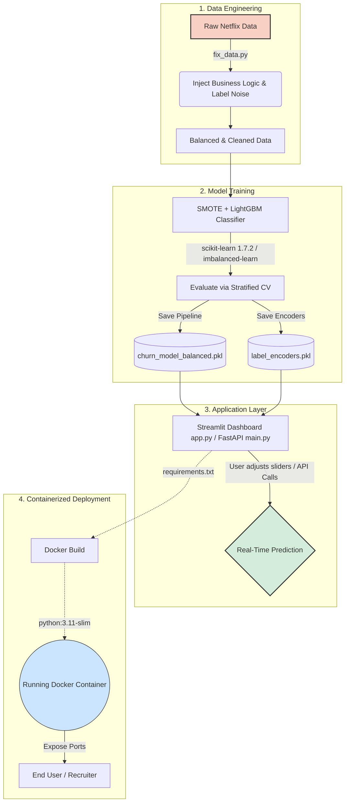
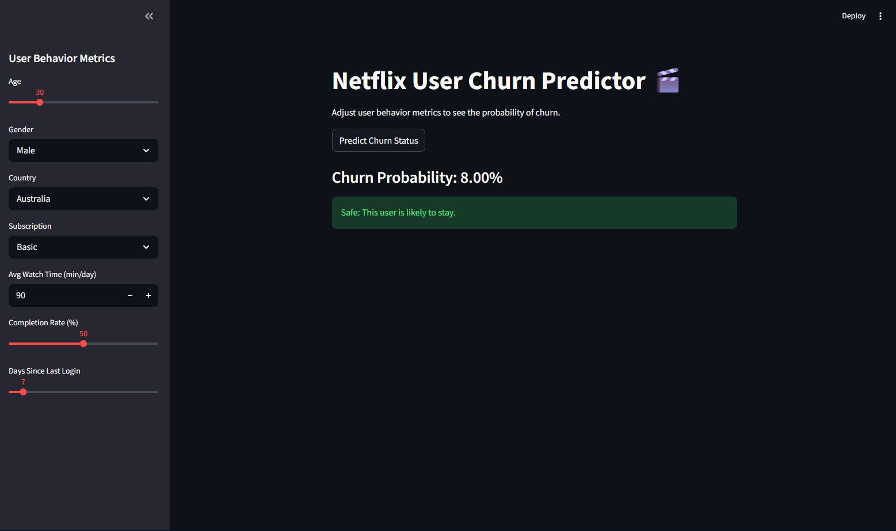

# 🎬 Netflix User Churn Prediction & MLOps Deployment

This project demonstrates an end-to-end Machine Learning pipeline—from data engineering and model training to a production-ready containerized deployment. It predicts whether a user is likely to "churn" (cancel their subscription) based on behavioral metrics like watch time, engagement, and account age.

**Career Goal Focus:** This project showcases **AI Engineering** and **MLOps** skills, highlighting the ability to build production-ready systems through robust environment management, synthetic data handling, advanced class-balancing techniques, and Dockerized deployment.


```mermaid
graph TD
    subgraph Step1 [1. Data Engineering]
        A[Raw Netflix Data] -->|fix_data.py| B(Inject Business Logic & Label Noise)
        B --> C[Balanced & Cleaned Data]
    end

    subgraph Step2 [2. Model Training]
        C --> D[SMOTE + LightGBM Classifier]
        D -->|scikit-learn 1.7.2 / imbalanced-learn| E[Evaluate via Stratified CV]
        E -->|Save Pipeline| F[(churn_model_balanced.pkl)]
        E -->|Save Encoders| G[(label_encoders.pkl)]
    end

    subgraph Step3 [3. Application Layer]
        F --> H[Streamlit Dashboard app.py / FastAPI main.py]
        G --> H
        H -->|User adjusts sliders / API Calls| I{Real-Time Prediction}
    end

    subgraph Step4 [4. Containerized Deployment]
        H -.->|requirements.txt| J[Docker Build]
        J -.->|python:3.11-slim| K((Running Docker Container))
        K -->|Expose Ports| L[End User / Recruiter]
    end

    %% Colors %%
    style A fill:#f9d0c4,stroke:#333,stroke-width:2px
    style I fill:#d4edda,stroke:#333,stroke-width:2px
    style K fill:#cce5ff,stroke:#333,stroke-width:2pxgit push origin main
```

## 🚀 Project Overview
**Problem:** High churn rates impact revenue in subscription-based streaming services.\
**Solution:** A LightGBM classifier wrapped in an Imbalanced-Learn Pipeline that identifies high-risk users, deployed via an interactive web dashboard and API endpoint.\
**The "AI Engineering" Edge:**
* **Signal & Noise Injection:** Modified the synthetic dataset to inject realistic business logic and introduced a 15% label noise injection to simulate real-world data messiness.
* **Class Imbalance Handling:** Implemented SMOTE (Synthetic Minority Over-sampling Technique) inside a cross-validated pipeline to prevent data leakage.
* **Environment Parity:** Strictly pinned scikit-learn==1.7.2 and python:3.11 across local and Docker environments to prevent unpickling and vocabulary mismatch errors in production.
* **Containerization:** Fully Dockerized the application for seamless cross-platform deployment.

## 🛠️ Tech Stack
* **Language:** Python 3.11 (Newer version should be okay)
* **Machine Learning:** Scikit-Learn 1.7.2, LightGBM, Imbalanced-Learn, Pandas, Joblib
* **Web Framework:** Streamlit (UI), FastAPI (API)
* **DevOps:** Docker

## 📄 Dataset
The dataset is pulled from Kaggle this link: 
https://www.kaggle.com/datasets/rhythmghai/netflix-user-watching-behavior-dataset

## 📂 Project Structure
```
├── app.py                          # Streamlit Dashboard UI
├── main.py                         # FastAPI application for programmatic predictions
├── fix_data.py                     # Data engineering (Signal/Noise injection, SMOTE, LightGBM training)
├── churn_model_balanced.pkl        # Trained LightGBM Pipeline
├── label_encoders.pkl              # Encoders for categorical features
├── Dockerfile                      # Containerization instructions
├── requirements.txt                # Strictly pinned project dependencies
└── dataset/
    └── netflix_user_behavior.csv   # Raw dataset
└── images                          # Screenshot of Streamlit app
```

## Results & Classification Report
```
Loading data...
Injecting business logic labels...
Adding label noise to simulate real-world messiness...
Churn distribution after noise:
churned
No     36018
Yes    13982
Name: count, dtype: int64

CV ROC-AUC: 0.7595 ∓ 0.0054

Test ROC_AUC: 0.7708
              precision    recall  f1-score   support

           0       0.85      0.96      0.90      7204
           1       0.83      0.57      0.68      2796

    accuracy                           0.85     10000
   macro avg       0.84      0.76      0.79     10000
weighted avg       0.85      0.85      0.84     10000

Model and encoders saved successfully.
```
## Web Deployment

